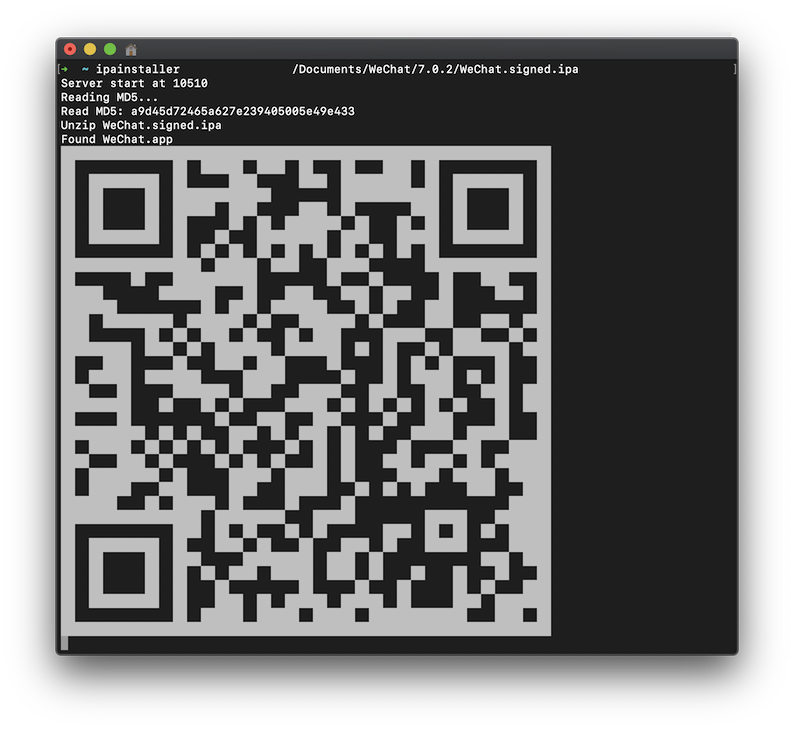

# IPAServer

[中文说明](README.zh_CN.md)
An IPA Wireless Installer

# Install

1. Clone (Download *.zip) repo.
2. `$ pod install`
3. Open *IPAServer.xcworkspace*
4. Select *IPAServer (Release)* scheme
5. Build
6. `$ ipainstaller`

You will get:

```
Usage:

    $ ipainstaller <IPA_PATH>

    IPA Wireless Installer

Requires:

    <IPA_PATH>      IPA file path

Options:

    --port <port>   Default: 10510


    --verbose       Show more information
    --help          Show help banner of specified command
    --silent        Show nothing
    --no-ansi       Show output without ANSI codes

```

# Usage

```shell
$ ipainstaller /path/to/*.ipa
```

And you will get a qrcode, then scan the code with QRCode App on your iOS device.



# Thanks

* [file.io](https://file.io)